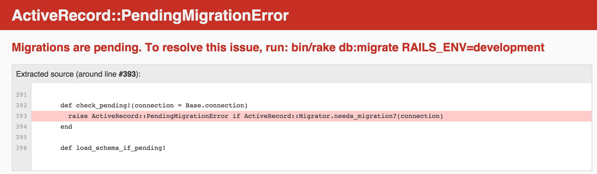

# Building Models with ActiveRecord & Migrations

### Objectives
*After this lesson, students will be able to:*

- Create a class that inherits from ActiveRecord
- Create a table schema to describe the class/model in our database
- Write a migration to update our model with new attributes
- Write a migration to change our model's attributes
- Write a migration to delete a model's attribute

### Preparation
*Before this lesson, students should already be able to:*

- Explain the concept of MVC
- Create a Rails app
- Define what object properties and methods are
- Write getter and setter methods to get retrieve and set property values


## Wait, what are Models? - Intro (15 mins)

#### Refresh on Models

We have been using Rails to create simple applications. However, we can apply the design pattern of MVC to make more complex applications. When we designed classes - or models of objects - we said we were 'modeling' them. So, our models allow us to deal with objects in our code.

> Note: It could be helpful to draw the request/response cycle diagram and talk through how MVC fits in.

#### But objects are just a collection of data, how can we map them to a relational database?

Well, that's where ORMs come in.  ORM stands for: **O**bject **R**elational **M**apping, and it's a technique that connects the rich objects of an application to tables in a relational database management system. Let's draw on the board how a user object, instantiated from the User class, could map to a Users table in our database.

Let's pretend we have a User class with the attributes id, name, age, and address:

```ruby
class User
  attr_accessor :id, :name, :age, :address
end
```

And let's pretend that we create a new user, Anthony Stark, whose object is shown below:

```ruby
=> #<User:0x007fc8b18c5718 @address="10880 Malibu Point, Malibu, Calif., 90265", @age=46, @id=1, @name="Anthony Stark">
```

With an ORM, we're able to take that instance of class User and map it to our relational database:

```psql
 id |      name     | age |                      address                       
----+---------------+-----+----------------------------------------------------
  1 | Anthony Stark |  46 | 10880 Malibu Point, Malibu, Calif., 90265          
(1 row)
```

Using ORMs, the properties and relationships of the objects in an application can be easily stored and retrieved from a database without writing SQL statements directly and with less database access code, overall.

#### An Actively Awesome ORM: ActiveRecord

Taken from [rubyonrails.org](guides.rubyonrails.org/active_record_basics.html):

Active Record, as an ORM Framework, gives us several mechanisms, the most important being the ability to:

- represent models and their data
- represent associations between these models
- represent inheritance hierarchies through related models
- validate models before they get persisted to the database
- perform database operations in an object-oriented fashion

Active Record is the M in MVC - the model - which is the layer of the system responsible for representing business data and logic.

This will all make a lot more sense once we start using it...so, let's start using it!


## Generating ActiveRecord Models - Codealong (30 mins)

We're a successful talent management agency, Tunr, and we have designed a Rails app to manage our artists. Let's just create the Rails application together. Go to your usual `code`/`project` directory and run:
```
rails new tunr -d postgresql
```

The `rails new` command will creare a new Rails application using the project name `tunr` as the name of the applicationdirectory. The `-d` option specifies the type of Database we will use so that Rails can fetch the appropriate libraries for this database. This command will generate the **complete** Rails directory structure inside the `tunr` folder. When it is completed, type `cd tunr` and then `subl tunr` to browse the content of the Rails appl.

#### Well, Rails is a gem
Open the file `GemFile` in Sublime and you can see all the gems required (so far) for our Rails application, including Rails itself. Rails depends on many other gems in order to run and we can look at them in the next section.

#### The ActiveRecord gem

'Ol and Behold! ActiveRecord is a also gem!  And since we are using Rails, we actually get ActiveRecord for free (well, sort of) as it is one of the key components in Rails. You can check out the dependency in the file `Gemfile.lock`.

```
    rails (4.2.1)
      actionmailer (= 4.2.1)
      actionpack (= 4.2.1)
      actionview (= 4.2.1)
      activejob (= 4.2.1)
      activemodel (= 4.2.1)
      activerecord (= 4.2.1)
      activesupport (= 4.2.1)
      bundler (>= 1.3.0, < 2.0)
      railties (= 4.2.1)
      sprockets-rails
```

#### Database configuration

One good thing about the `rails new` command is that it has automagically set up the database configuration for you. Yay! You can find the configuration file at `config\database.yml`. We will only be using the development database for now and Rails has suggested a DB name for us already, which is `tunr_development`. This is yet another **convention** Rails uses in database naming so please get used to it.

```yaml
development:
  adapter: postgresql
  database: tunr_development
```

`.yml` is the extension of YAML file. YAML stands for `YAML Ain't Markup Language` and you can find out more information at the [official website](http://yaml.org/). YAML is a data serialization standard Rails uses to maintain its configuration files.  

#### Create the Database!!

Please note that at this point the database **has NOT been** created yet. So let's do it now. Remember to start your Postgresql server first. To creare a database, whereas earlier you learned to do this:

```bash
$ psql
psql (9.4.1, server 9.3.5)
Type "help" for help.

username=# create database tunr;
CREATE DATABASE
```

Now, we can wrap that up in one terminal command:

`rake db:create`

Run it. Boom, database created.

This simply works without defining the DB URL and port explicitly as long as the Postgresql DB server is running locally using the default port number. 

Also note that we have introduced another new tool called `Rake`. Rake technically stands for 'ruby make', which is a tool we're going to use to do tasks for us. You can program your own rake functions, but active record comes with a bunch, and we're gonna use one to create our database in Postgres. For those who are **still** curious (inquistitive, you are), `make` is a classic utility in UNIX (you can find it in Mac as well) for building large program.

#### Create our first Model

Let's create a model for Artists. We can use the following `rails` command to do that:
```
rails g model artist name:string photo_url:string nationality:string
```
This command `rails g` (same as `rails generate`) generates an ActiveRecord model called `Artist`. The name of the Model should be in singular (i.e. artist) format. The model was created with 3 string attributes.

This command will produce the following output:
```
Willies-MacBook-Pro:tunr sytong$ rails g model artist name:string photo_url:string nationality:string
Running via Spring preloader in process 53577
      invoke  active_record
      create    db/migrate/20160223143622_create_artists.rb
      create    app/models/artist.rb
      invoke    test_unit
      create      test/models/artist_test.rb
      create      test/fixtures/artists.yml
```

The command produced 4 files. The model class file is generated as `app/models/artist.rb`. We can ignore the `test/models/artist_test.rb` and `test/fixtures/artists.yml` for now. The file `db/migrate/20160223143622_create_artists.rb` is a Migration file and we will discuss its usage next.

Before we proceed, let's take a look at the model class should we?

```ruby
  class Artist < ActiveRecord::Base
  end
```

The Artist class is a subclass of `ActiveRecord::Base` and the class file is empty. Now that we have generated a model, let's start our application by running `rails s` (or `rails server`). 

Let's check out the server at `http://localhost:3000/`.

But... Oops... What's going on?

  

Apparently, something called "Migrations" are pending and if we don't do that, the server won't start. Remember the file `db/migrate/20160223143622_create_artists.rb` generated by `rails g`? It is probably a good time to take a look at this file now:

```
class CreateArtists < ActiveRecord::Migration
  def change
    create_table :artists do |t|
      t.string :name
      t.string :photo_url
      t.string :nationality

      t.timestamps null: false
    end
  end
end
```

*"Migrations are a convenient way to alter your database schema over time in a consistent and easy way. They use a Ruby DSL so that you don't have to write SQL by hand, allowing your schema and changes to be database independent. You can think of each migration as being a new 'version' of the database."*

Migrations tell your application what goes into your database, and each one is timestamped, so it knows how to walk through them over time. This is crucial, especially when on a team of developers, because it keeps your database up-to-date even when someone else changes it – the computer always has a history of changes via new migration files.

As the error message suggested, we need to run the migration in order to create the `artists` table in the DB. So what are you waiting for? Run it!!
```
rake db:migrate
```

After running the command, you should see this in the iTerm:
```
Willies-MacBook-Pro:tunr sytong$ rake db:migrate
== 20160223143835 CreateArtists: migrating ====================================
-- create_table(:artists)
   -> 0.0077s
== 20160223143835 CreateArtists: migrated (0.0077s) ===========================
```
If you refresh the browser, you should see the familiar Rails welcome page!

Congratulations, you have just successfully run your first ActiveRecord migration and now we have a table in the database! Nice work!

_Now_ Rails has also generated a `schema.rb` file for us too – this file is _sacred_. Not to be touched, only to be admired. It's a snapshot of the current state of your database, and `rake` is the only one who should be modifying it, ever.

If ever you're unsure what a database looks like, browse your `schema.rb`. It is located inside the `db` folder:
```ruby
ActiveRecord::Schema.define(version: 20160223143835) do

  # These are extensions that must be enabled in order to support this database
  enable_extension "plpgsql"

  create_table "artists", force: :cascade do |t|
    t.string   "name"
    t.string   "photo_url"
    t.string   "nationality"
    t.datetime "created_at",  null: false
    t.datetime "updated_at",  null: false
  end

end
```

Wait a minute? Where did the columns `created_at` and `updated_at` come from? 

This is another *magic* trick ActiveRecord has done behind the scene. When the migration script was run, ActiveRecord sees the line `t.timestamp null: false` in the migration script and it will create two columns in the `artists` table: `created_at` and `updated_at`. These 2 columns are super useful because ActiveRecord will automatically update them whenever an artist record is created or is modified. It is _FREE_!! Not bad, huh?

#### Before we go on, are you curious about what else rake can do?

So far we have used the `rake` command to create database and also run migration scripts. Are you wondering what other tasks `rake` can do? It is very easy to find out. Go to your project directory and run `rake -T`. Here is the list you should see:
```
rake about                              # List versions of all Rails frameworks and the environment
rake assets:clean[keep]                 # Remove old compiled assets
rake assets:clobber                     # Remove compiled assets
rake assets:environment                 # Load asset compile environment
rake assets:precompile                  # Compile all the assets named in config.assets.precompile
rake cache_digests:dependencies         # Lookup first-level dependencies for TEMPLATE (like messages/show or comments/_comment.html)
rake cache_digests:nested_dependencies  # Lookup nested dependencies for TEMPLATE (like messages/show or comments/_comment.html)
rake db:create                          # Creates the database from DATABASE_URL or config/database.yml for the current RAILS_ENV (use db:create:all to create all databases in the ...
rake db:drop                            # Drops the database from DATABASE_URL or config/database.yml for the current RAILS_ENV (use db:drop:all to drop all databases in the config)
rake db:fixtures:load                   # Load fixtures into the current environment's database
rake db:migrate                         # Migrate the database (options: VERSION=x, VERBOSE=false, SCOPE=blog)
rake db:migrate:status                  # Display status of migrations
rake db:rollback                        # Rolls the schema back to the previous version (specify steps w/ STEP=n)
rake db:schema:cache:clear              # Clear a db/schema_cache.dump file
rake db:schema:cache:dump               # Create a db/schema_cache.dump file
rake db:schema:dump                     # Create a db/schema.rb file that is portable against any DB supported by AR
rake db:schema:load                     # Load a schema.rb file into the database
rake db:seed                            # Load the seed data from db/seeds.rb
rake db:setup                           # Create the database, load the schema, and initialize with the seed data (use db:reset to also drop the database first)
rake db:structure:dump                  # Dump the database structure to db/structure.sql
rake db:structure:load                  # Recreate the databases from the structure.sql file
rake db:version                         # Retrieves the current schema version number
rake doc:app                            # Generate docs for the app -- also available doc:rails, doc:guides (options: TEMPLATE=/rdoc-template.rb, TITLE="Custom Title")
rake log:clear                          # Truncates all *.log files in log/ to zero bytes (specify which logs with LOGS=test,development)
rake middleware                         # Prints out your Rack middleware stack
rake notes                              # Enumerate all annotations (use notes:optimize, :fixme, :todo for focus)
rake notes:custom                       # Enumerate a custom annotation, specify with ANNOTATION=CUSTOM
rake rails:template                     # Applies the template supplied by LOCATION=(/path/to/template) or URL
rake rails:update                       # Update configs and some other initially generated files (or use just update:configs or update:bin)
rake routes                             # Print out all defined routes in match order, with names
rake secret                             # Generate a cryptographically secure secret key (this is typically used to generate a secret for cookie sessions)
rake stats                              # Report code statistics (KLOCs, etc) from the application or engine
rake test                               # Runs all tests in test folder
rake test:all                           # Run tests quickly by merging all types and not resetting db
rake test:all:db                        # Run tests quickly, but also reset db
rake test:db                            # Run tests quickly, but also reset db
rake time:zones:all                     # Displays all time zones, also available: time:zones:us, time:zones:local -- filter with OFFSET parameter, e.g., OFFSET=-6
rake tmp:clear                          # Clear session, cache, and socket files from tmp/ (narrow w/ tmp:sessions:clear, tmp:cache:clear, tmp:sockets:clear)
rake tmp:create                         # Creates tmp directories for sessions, cache, sockets, and pids
```

## Changes to our DB - Demo (10 mins)

Just like we can write migrations to create tables, we can write migrations to add, change or delete attributes, update data types, change table names, and even delete tables.

We decided we want to collect data about the instruments the artists play, so we need to create a migration by running `rails g migration <name_of_migration>`. The `name_of_migration` should be a short description of what this migration is about.

```bash
Willies-MacBook-Pro:tunr sytong$ rails g migration add_instrument_to_artists
Running via Spring preloader in process 7736
      invoke  active_record
      create    db/migrate/20160227075312_add_instrument_to_artists.rb
```

As indicated in the response, a new migration is created at ```db/migrate/20150710154423_add_instrument_to_artists.rb```. Let's edit this file by filling in the content of the `change` method:

```ruby
class AddInstrumentToArtists < ActiveRecord::Migration
  def change
    add_column :artists, :instrument, :string
  end
end
```

You can probably guess what this line - ```add_column :artists, :instruments, :string``` - says: "add a column to the artists table called 'instruments' with a string as its data type".  Run the migration with ```rake db:migrate``` and BAM, you have a new column.

Do this _every_ time you need to change your database – whether it's adding or removing. Changing the database in any way means making a new migration, and telling the computer what you need done. Think of it as an assistant; you don't do the tedious Postgres work, you just tell it what needs doing and tell it to go do it.

#### Changing or deleting column

By now, you've felt the pattern: create a migration, add the appropriate code to the migration, and then run the migration.  Same applies for each time you want to modify your database.  In the case of a updating a column, you would:

```bash
rails g migration change_column_in_artists_to_new_column
```

In the migration add:

```ruby
def change
  # :table, :old_column, :new_column are just PLACEHOLDER
  # You should use your own table name and column names!!
  # DO NOT simply copy and paste this!!
  rename_column :table, :old_column, :new_column
end
```

Then:

```bash
rake db:migrate
```

According to [the official ActiveRecord docs](http://edgeguides.rubyonrails.org/active_record_migrations.html), these are all the migration definitions the change method allows you to use in a migration:

- add_column
- add_index
- add_reference
- add_timestamps
- add_foreign_key
- create_table
- create_join_table
- drop_table (must supply a block)
- drop_join_table (must supply a block)
- remove_timestamps
- rename_column
- rename_index
- remove_reference
- rename_table

As always, if you can't remember the exact syntax, consult the official documentation or look it up from Google!


## Independent Practice (10 minutes)

> ***Note:*** _This can be a pair programming activity or done independently._

For the last part of class, the guys at Tunr, decided they need more information about the people they represent.  Do the following to make it happen:

- Add another column to your Artists table named "address" that stores string data
- Add a column with a different data type, and then delete it
- Update an existing column to have a different name
- Check your migration results using `psql`
- If your last migration went wrong, no worries, run `rake db:rollback` to revert the last change.

Finally when you have run all your migrations, it is time to generate the necessary `scaffold` for your views and controllers. Are you ready? Let's do it! This time we cannot use `rails g scaffold` because this command will generate the model as well. Instead, we should use `rails g scaffold_controller` which will generate the view files and controller only.

Run the following command by replacing the placeholder with the current set of attributes of the `Artist` model.

```
rails g scaffold_controller artist field1:type1 field2:type2 ....

```

If the command is successful, you should see the below output:
```bash
      create  app/controllers/artists_controller.rb
      invoke  erb
      create    app/views/artists
      create    app/views/artists/index.html.erb
      create    app/views/artists/edit.html.erb
      create    app/views/artists/show.html.erb
      create    app/views/artists/new.html.erb
      create    app/views/artists/_form.html.erb
      invoke  test_unit
      create    test/controllers/artists_controller_test.rb
      invoke  helper
      create    app/helpers/artists_helper.rb
      invoke    test_unit
      invoke  jbuilder
      create    app/views/artists/index.json.jbuilder
      create    app/views/artists/show.json.jbuilder
```

## Conclusion (5 mins)
- What is ActiveRecord and how does it interact with your database?
- What are migrations?
- Briefly, describe how to configure your Rails app to use ActiveRecord.
