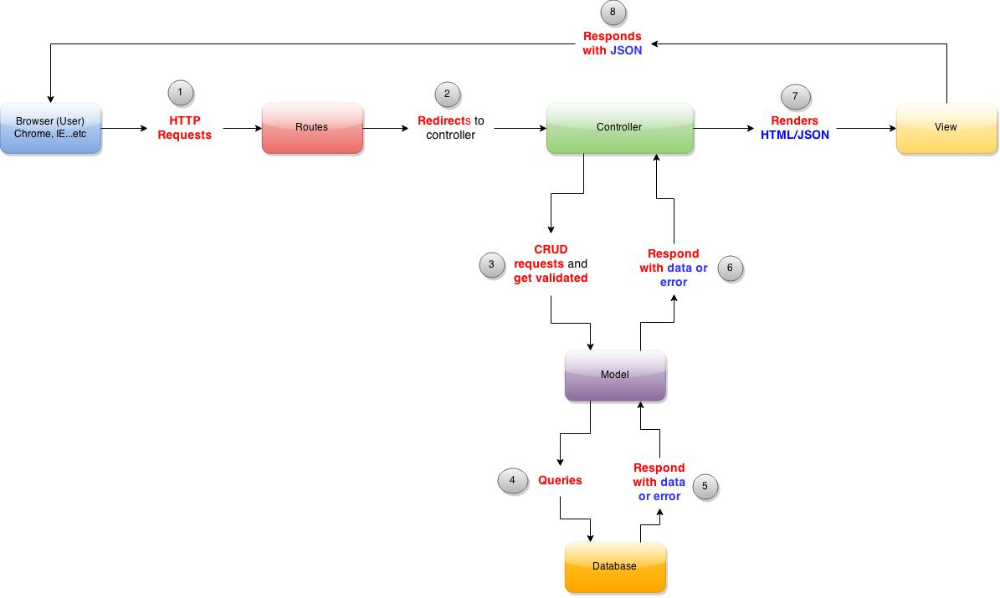

# Rails Architecture Introduction

### Objectives
*After this lesson, students will be able to:*
  - Explain what is MVC architecture
  - Explain the key responsibilities of Model, View and Controller
  - Explain how MVC architecture is applied in Rails
  - Explain what is ORM and why we need it

### Preparation
*Before this lesson, students should already be able to:*
  - Understand basic OOP concepts
  - Do basic Ruby programming
  - Understand general software system architecture: client, server and database

## A Brief History of MVC
Model-view-controller (MVC) is a software architectural pattern originally aimed at implementing Graphical User Interfaces (GUI) in computers. A Norwegian computer scientist called Trygve Reenskaug first introduced the idea of model-view-controller pattern to the Smalltalk-76 language back in 1979 while he was visiting the Xerox Palo Alto Research Center (PARC). The MVC concept was later implemented in the Smalltalk-80 library.

Smalltalk is a language first appeared in 1972 and reached the first stable release as Smalltalk-80 in 1980. It is one of the earliest Object-Oriented programming languages and it has huge influence on other languages such as Objective-C, Java, Python and **Ruby**.

## Model, View and Controller - The mordern web design
In the mordern MVC design, applications were broken into four types of components: models, views, controllers and routes.

### Model

The model is responsible for maintaining the states of the application. Sometimes the states only last for a few interactions with the user. Other times, the states are permanent and have to be persisted in an external store, such as a database.

A model is also where we should enforce the **business logics** that apply to the data. A classic example would be a bank account: in an imaginary banking application, a bank account model should not allow a debit of $100 if the account only has $50.

### View

The view is where we display the states of the model(s). In the classic design, the view would be notified when the model has changed and the view is responsible to get the data from Model.

Note the we can have different views that display the same data from the model. For example, one view can list data in a table and anothe view can use graphs and charts to do that.

### Controller

The controller captures user's actions and informs the model that there are changes to the data.

### Router

Redirect user's request to the appropriate controller

### Putting it together
The MVC architecture is a fine example of **separation of concerns** which means that we don't want to clutter the model with the logics of rendering data as these should belong in the view. Likewise, the view does not need to know how to  handle the business logics. In other words, the code will be **less coupled** and will be easier to write and maintain. Here is how the model, view and controller should interact with each other.

  

###The Components:

1. **User**
2. **Routes** - Point the user request to the correct controller
3. **Controller** - Processes the user request
4. **Model** - Validates the data before querying the Database
5. **Database** - Contains all the data
4. **View** - Define response format (HTML/JSON or other formats)

###How it works:

1. **User** enters http://www.google.com/ in the browser.
2. **Routes** check the link and redirect to the appropriate controller.
3. **Controller** process request with predefined logics
4. **Model** check if the data meet all validation requirements
5. **Database** store, retrieve, modify, or delete data
6. **Model** responds controller with data.
7. **Controller** might further process data, generate the HTML/JSON and return data to the browser.
8. **View** defines how the HTML/JSON format
